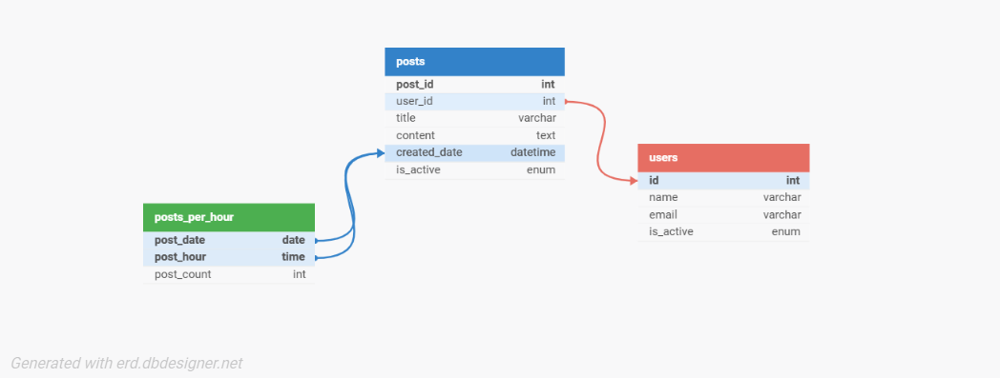

# inManage - Home Assignment - Posts Tracker
### About
The Posts Tracker is a PHP and MySQL based project that focuses on managing and analyzing posts and user data. The project integrates three main tables: Posts, Users, and Posts Per Hour. It includes several key features designed to track user activity, count posts, and interact with external services for data insertion.
### Technologies Used
- PHP
- MySQL
- XAMPP
- HTML

#### Steps to Run
1. XAMPP/LAMP/WAMP: Install a local server environment.
2. install PHP and MySQL.
2. Clone the project or download the files to your local server.
3. Create a new database.
4. Create the necessary tables (posts, users, and posts_per_hour) via create_tables.php file.
5. Start your XAMPP/LAMP/WAMP server.
6. Open your browser and navigate to http://localhost/your_project_folder/ to see the project running.
7. Use the built-in test cases to validate functionality.

### Features
1. <b>Fetch Photo:</b>  
The project includes functionality to fetch an avatar photo from an external URL and save it locally.
2. <b>Insert Data via cURL Web Services:</b>  
The project supports inserting data via cURL web services, enabling interaction with external APIs to add posts and users.
3. <b>Show Posts and Users:</b>  
The application displays posts and user data, providing a social-media style interface for browsing through content and viewing user profiles.
4. <b>show the last post of the user that have birthday:</b>  
The system tracks users birthdays and can highlight posts made by users with birthdays in the current month.
5. <b>Count Posts per hour:</b>  
The system counts the number of posts made by users per hour and stores in a table 'posts_per_hour'.

### Tests in the Project:
The project includes several tests to ensure that the core functionalities are working correctly:
1. <b>Photo Fetch Test:</b>
This test checks that the image fetching feature correctly downloads and saves the image from the provided URL.

2. <b>Post Count Query Test:</b>
This test verifies that the query to count posts per hour works as expected. It checks that the posts are counted and inserted into the posts_per_hour table accurately.

### Database Schema

